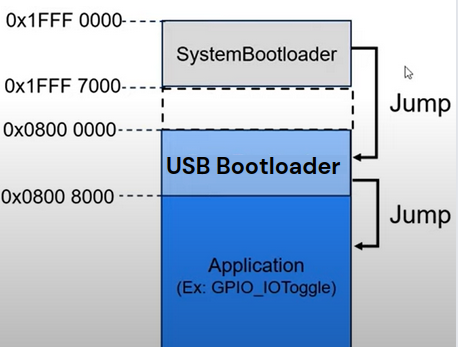
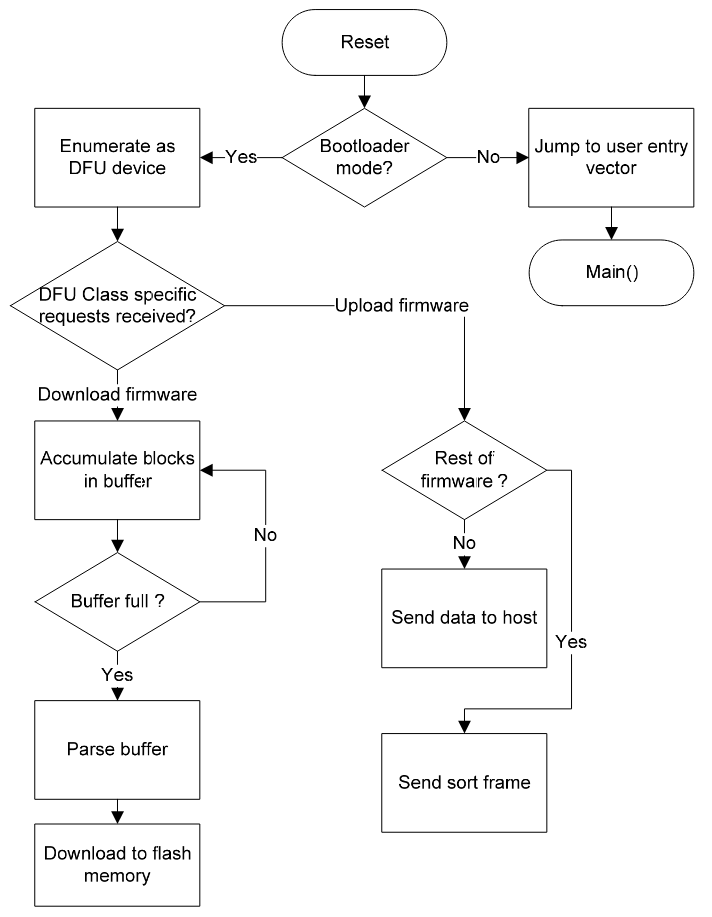
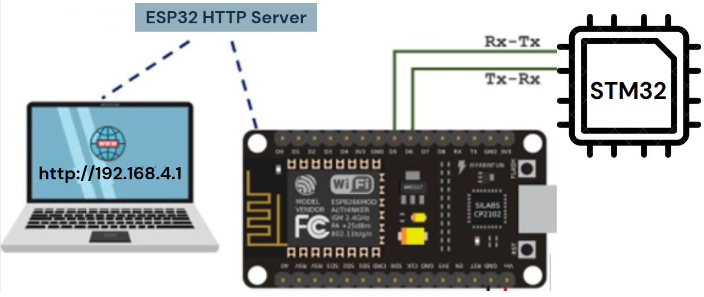

[![Forks][forks-shield]][forks-url]
[![Stargazers][stars-shield]][stars-url]
[![Issues][issues-shield]][issues-url]
[![LinkedIn][linkedin-shield]][linkedin-url]

<!-- PROJECT LOGO -->
 

  

  <h3 align="center">USB OTA Bootloader Integrated Custom STM Board</h3>

  

    USB & OTA Bootloader Firmware with Custom STM32 Board Design and Integrated Wi-Fi!
     
    <a href="https://github.com/SurajSonawane2415/USB-OTA-Bootloader-Integrated-Custom-STM-Board?tab=readme-ov-file#table-of-contents"><strong>Explore the docs »</strong></a>
     
     
    <a href="https://github.com/SurajSonawane2415/USB-OTA-Bootloader-Integrated-Custom-STM-Board/">View Outcomes</a>
    ·
    <a href="https://github.com/SurajSonawane2415/USB-OTA-Bootloader-Integrated-Custom-STM-Board/issues">Report Bug</a>
    ·
    <a href="https://github.com/SurajSonawane2415/USB-OTA-Bootloader-Integrated-Custom-STM-Board/issues">Request Feature</a>
    ·
    <a href="https://github.com/SurajSonawane2415/USB-OTA-Bootloader-Integrated-Custom-STM-Board/pulls">Send a Pull Request</a>
  

## Table of Contents
- [USB-OTA-Bootloader-Integrated-Custom-STM-Board](#usb-ota-bootloader-integrated-custom-stm-board)
  - [Table of Contents](#table-of-contents)
  - [About The Project](#about-the-project)
    - [Project Workflow](#project-workflow)
    - [STM32 USB DFU Bootloader](#stm32-usb-dfu-bootloader)
    - [STM32 OTA Bootloader](#stm32-ota-bootloader)
    - [STM32 Custom Development Board](#stm32-custom-development-board)
    - [Project Outcomes](#project-outcomes)
    - [Features](#features)
  - [Contributor](#contributor)
  - [Acknowledgements](#acknowledgements)
  - [Resources](#resources)

<!-- ABOUT THE PROJECT -->
## About The Project
[Screenshould should include USB OTA detected screenshot and PCB image]
[![Product Name Screen Shot][product-screenshot]](https://example.com)

The project involves developing a custom STM32 board with integrated USB and Over-the-Air (OTA) bootloader capabilities, featuring an onboard ESP32 Wi-Fi module. Users can flash firmware onto the STM32 microcontroller either through USB using DFU mode or wirelessly via Wi-Fi for remote updates. The USB bootloader ensures secure and validated firmware updates, while the OTA bootloader simplifies wireless updates without requiring physical access. The custom PCB is designed around the STM32F103 microcontroller, optimized for seamless USB and Wi-Fi communication. The onboard ESP32 enables the board to be used in various Wi-Fi-based projects, including IoT applications and remote monitoring systems. This makes the board highly versatile for developers working on embedded and network-connected systems.

<!-- ROADMAP -->
## Project Workflow

- **Implemented USB Bootloader**: Developed a USB bootloader using DFU mode for firmware updates via USB.

- **Implemented OTA Bootloader**: Developed an OTA bootloader using the onboard ESP32 Wi-Fi module, enabling wireless firmware updates.

- **Custom STM Board Design**: Designed a custom PCB for the STM32F103 microcontroller in KiCad, optimized for USB and Wi-Fi communication.

- **Currently Manufacturing and Testing**: The board is in the manufacturing stage. After that, I will proceed with assembly and testing.
  

## STM32 USB DFU Bootloader

    

The USB DFU Bootloader is a custom firmware update solution designed for STM32 microcontrollers, leveraging the USB Device Firmware Upgrade (DFU) protocol for standardized and efficient firmware updates. It initializes the USB peripheral and handles DFU control and data transfer requests through a dedicated state machine. The bootloader is placed in the flash memory's beginning and checks for boot conditions to decide whether to enter DFU mode or execute the main application. A post-build script for STM32CubeIDE automates firmware uploading using STM32CubeProgrammer, ensuring streamlined deployment and updates. This implementation supports reliable firmware management and easy upgrades in a standardized manner.

- **USB DFU bootloader sequence:**

    

## STM32 OTA Bootloader

    

The STM32 OTA Bootloader enables firmware updates over UART using an ESP32 as the host for over-the-air (OTA) updates. The custom bootloader on the STM32 receives the new firmware from the ESP32, writes it to flash memory (128 KB in size), and verifies the integrity using a verifyFlashedData function to ensure data accuracy.

The ESP32 communicates with the STM32 via UART, transferring the firmware in chunks and triggering a reboot once the transfer is complete. Error handling is implemented to prevent booting corrupted firmware, ensuring the system only runs verified updates. The bootloader also carefully manages flash memory, avoiding conflicts with existing data.

This implementation allows remote firmware updates without physical access, making it ideal for field-deployed systems requiring periodic updates.

## STM32 Custom Development Board

The custom development board is built around the STM32F103RBT6 microcontroller, featuring a 64-pin LQFP package and an Arduino shield-compatible layout. It incorporates an ESP32-WROOM-32D module for dual-core Wi-Fi and Bluetooth communication. The board features protection diodes for over-voltage and reverse polarity protection, along with a slider switch for boot mode selection (enabling easy access to boot0/boot1 for flashing or debugging). It also includes a 32.768kHz crystal for real-time clock (RTC) functionality, and an 8MHz crystal for the main system clock, ensuring precise timing. Additionally, sensor ports, power regulation circuits, and GPIO breakout headers enhance its functionality, making it ideal for high-performance embedded applications.

## Project Outcomes

#### STM32 USB DFU Bootloader:

#### STM32 OTA Bootloader: 

#### STM32 Custom Development Board:

## Features
- **Arduino Shield Compatibility:** Standard headers for easy integration with Arduino-compatible shields and peripherals.
- **Integrated OTA Bootloader:** Supports Wireless over-the-air firmware updates enabled via the onboard ESP32 module.
- **Integrated USB Bootloader:** Supports firmware flashing via USB, eliminating the need for external programmers.
- **Onboard Wi-Fi Module:** ESP32-WROOM-32D module for seamless integration with Wi-Fi-based projects.
  
## Hardware and Software Used

#### Hardware:
- **STM32F103RBT6**: Main microcontroller with 64-pin configuration.
- **ESP32-WROOM-32D**: Onboard Wi-Fi module for OTA updates and wireless communication.

#### Software:
- **STM32CubeIDE**: IDE for developing and debugging STM32 applications.
- **STM32CubeProgrammer**: Tool for programming and managing firmware updates via USB.
- **libopencm3**: Open-source library for STM32 peripheral control.
- **dfu-util**: Tool for performing USB Device Firmware Upgrade (DFU) on STM32.
- **Batch Script**: Automates firmware flashing with STM32CubeIDE.

<!-- CONTRIBUTING -->
## Contributor
- [Suraj Sonawane](https://github.com/SurajSonawane2415/) - [mail](mailto:surajsonawane0215@gmail.com)

<!-- ACKNOWLEDGEMENTS -->
## Acknowledgements
I would like to express my heartfelt gratitude to [Prof. Sidharth Tallur](https://www.ee.iitb.ac.in/web/people/siddharth-tallur/) for his invaluable guidance and support throughout my internship at [WEL Lab, IIT Bombay.](https://www.ee.iitb.ac.in/~wel_iitb/index.php) I also extend my sincere thanks to Mr. Ankur Agrawal, Maheshwar Manghgat, and Amit Shete for providing the resources and creating a supportive environment that greatly facilitated my learning and growth during this period.

## Resources

- [AN3156: USB DFU Protocol used in STM32 Bootloader (ST)](https://www.st.com/resource/en/application_note/an3156-usb-dfu-protocol-used-in-the-stm32-bootloader-stmicroelectronics.pdf)
- [AN3155: USART Protocol used in STM32 Bootloader (ST)](https://www.st.com/resource/en/application_note/an3155-usart-protocol-used-in-the-stm32-bootloader-stmicroelectronics.pdf)
- [KiCad Tutorial Playlist](https://youtube.com/playlist?list=PL3bNyZYHcRSUhUXUt51W6nKvxx2ORvUQB&si=sIpOzehl4u3am8eR)
- [libopencm3](https://github.com/libopencm3/libopencm3): An open-source library for ARM Cortex-M microcontrollers that simplifies working with low-level hardware interfaces by providing essential peripheral support for STM32.

<!-- MARKDOWN LINKS & IMAGES -->
<!-- https://www.markdownguide.org/basic-syntax/#reference-style-links -->
[forks-shield]: https://img.shields.io/github/forks/roshanlam/ReadMeTemplate?style=for-the-badge
[forks-url]: https://github.com/SurajSonawane2415/USB-OTA-Bootloader-Integrated-Custom-STM-Board/network/members
[stars-shield]: https://img.shields.io/github/stars/roshanlam/ReadMeTemplate?style=for-the-badge
[stars-url]: https://github.com/SurajSonawane2415/USB-OTA-Bootloader-Integrated-Custom-STM-Board/stargazers
[issues-shield]: https://img.shields.io/github/issues/roshanlam/ReadMeTemplate?style=for-the-badge
[issues-url]: https://github.com/SurajSonawane2415/USB-OTA-Bootloader-Integrated-Custom-STM-Board/issues
[linkedin-shield]: https://img.shields.io/badge/-LinkedIn-black.svg?style=flat-square&logo=linkedin&colorB=555
[linkedin-url]: https://www.linkedin.com/in/suraj-sonawane-aba34b231/
